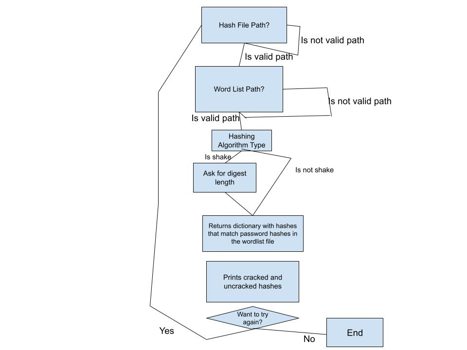
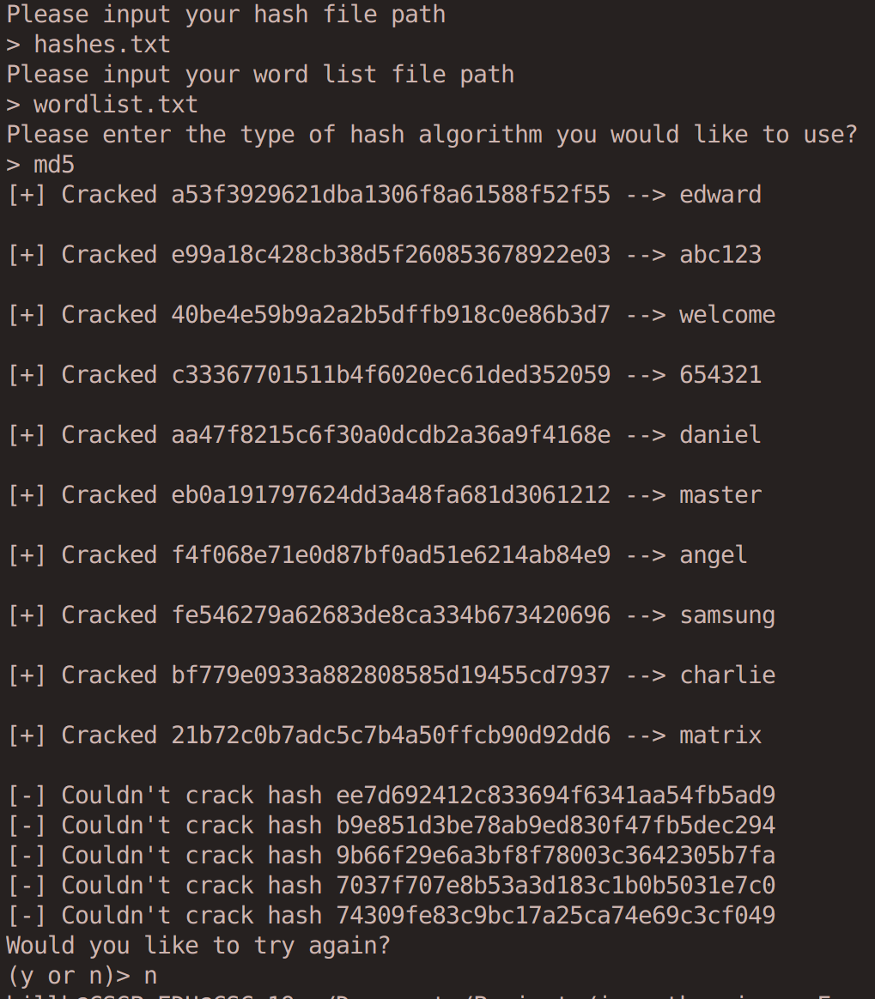

# Jane The Ripper
This is a password-cracking program that allows the user to import a hash file and a wordlist file, and then compare the hashed wordlist to the hashes in the hash file to see which passwords line up with which hashes. This allows for the passwords to be CRACKED

## Requirements
- Python 3+
- HashLib library
- OS library
- Template hashes.txt and wordlist.txt, or your own hash and wordlist file

## How to Run
1. Clone this repo by running `https://github.com/WTCSC/jane-the-ripper-Fooot-Code.git` in a terminal
2. Type `python3 jane_the_ripper.py` to run the python file
3. Input your hash file, word list file, and algorithm type, and watch the cracking happen

## How to Test
1. Install pytest
2. Type pytest in the terminal
3. Watch as my tests pass

## Flowchart
    

## Example Runthrough
